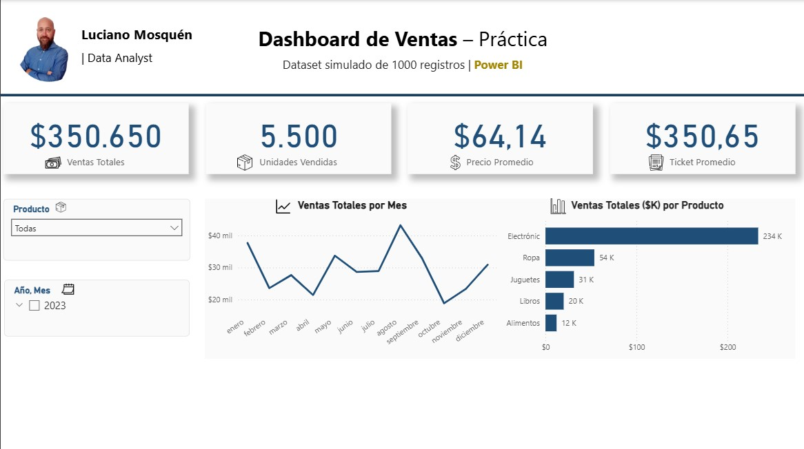

# 📊 Dashboard de Ventas – Práctica en Power BI

  

👋 Hola, soy **Luciano Mosquén**  
Senior Data Analyst con más de 13 años de experiencia en **Power BI, SQL, Python y automatización de reportes**.  

Este proyecto es un **ejemplo práctico en Power BI** utilizando un dataset simulado de ventas.  
El objetivo es mostrar cómo estructurar un dashboard claro y profesional, con métricas clave, segmentadores y visualizaciones relevantes para el análisis de negocio.

---

## 📂 Estructura del repositorio
---
## PowerBI_Sales_Dashboard/
│
├── Dashboards/
│ └── Dashboard_Ventas.pbix # Archivo del dashboard en Power BI
│
├── Images/
│ └── dashboard_preview.png # Imagen de vista previa del dashboard
│
└── README.md # Documentación del proyecto

---

## 📸 Vista previa

---

## 🔑 Métricas principales

- **💰 Ventas Totales** → SUM(Total Venta)  
- **📦 Unidades Vendidas** → SUM(Cantidad)  
- **📊 Precio Promedio** → AVERAGE(Precio Unitario)  
- **🧾 Ticket Promedio** → Ventas Totales / Nº de Transacciones  

---

## 📈 Visualizaciones incluidas

- **Tarjetas (KPIs):** métricas principales del negocio.  
- **Gráfico de líneas:** evolución de ventas totales por mes.  
- **Gráfico de barras horizontales:** ventas totales por producto.  
- **Segmentadores:** por producto y por fecha (Año/Mes).  

---

## 🎯 Objetivo

- Practicar el diseño de dashboards con un enfoque profesional.  
- Mostrar buenas prácticas de visualización: consistencia de colores, tipografía clara y uso de íconos.  
- Incorporar branding personal (foto y nombre) como muestra de portafolio.  

---

## 📬 Contacto

- LinkedIn: [www.linkedin.com/in/lucianomosquen](https://www.linkedin.com/in/lucianomosquen)  
- Email: luciano.mosquen@gmail.com  

Este repositorio forma parte de mi **portafolio profesional en análisis de datos y visualización con Power BI**.
