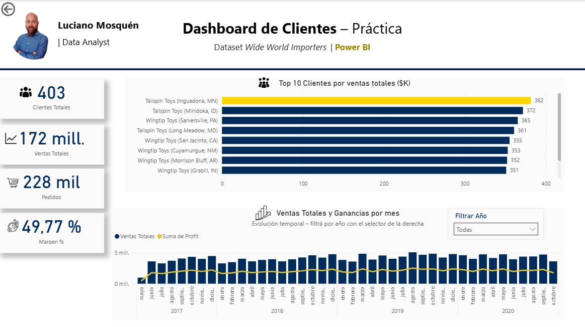

# 📊 Dashboards en Power BI – Práctica  

    

👋 Hola, soy **Luciano Mosquén**  
Senior Data Analyst con más de 13 años de experiencia en **Power BI, SQL, Python y automatización de reportes**.  

Este repositorio reúne **ejemplos prácticos de dashboards en Power BI**, desarrollados con datasets simulados y de práctica.  
El objetivo es mostrar cómo estructurar reportes claros y profesionales, con métricas clave, segmentadores y visualizaciones relevantes para el análisis de negocio.  

---

## 📂 Estructura del repositorio

```text
PowerBI_Dashboards/
│
├─ Dashboards/
│  ├─ Ventas1.pbix          # Dashboard de Ventas (dataset simulado)
│  └─ Clientes1.pbix        # Dashboard de Clientes (Wide World Importers)
│
├─ Images/
│  ├─ Ventas1.jpg           # Preview dashboard Ventas
│  └─ Clientes1.jpg         # Preview dashboard Clientes
│
└─ README.md                # Documentación del proyecto

```
## 📸 Vistas previas

### Dashboard de Ventas – Dataset simulado  


### Dashboard de Clientes – Wide World Importers  


---

## 🔑 Métricas principales

**Ventas (dataset simulado):**
- 💰 Ventas Totales  
- 📦 Unidades Vendidas  
- 📊 Precio Promedio  
- 🧾 Ticket Promedio  

**Clientes (Wide World Importers):**
- 👥 Clientes Totales  
- 💰 Ventas Totales  
- 🛒 Pedidos  
- 📈 Margen (%)  
- 🏆 Top 10 Clientes por ventas  
- 📉 Evolución de Ventas y Profit por mes/año  

---

## 📈 Visualizaciones incluidas

- **Tarjetas (KPIs):** métricas principales del negocio.  
- **Gráfico de líneas/columnas combinadas:** evolución temporal de ventas y profit.  
- **Gráfico de barras:** ventas totales por producto / top clientes.  
- **Segmentadores:** producto, fecha (año/mes), filtro por año (localizado).  
- **Subtítulos explicativos y branding personal.**  

---

## 🎯 Objetivo

- Practicar el diseño de dashboards con un enfoque profesional.  
- Mostrar buenas prácticas de visualización: consistencia de colores, tipografía clara y uso de íconos.  
- Incorporar branding personal (foto y nombre) como muestra de portafolio.  

---

## 📬 Contacto

- LinkedIn: [www.linkedin.com/in/lucianomosquen](https://www.linkedin.com/in/lucianomosquen)  
- Email: luciano.mosquen@gmail.com  

Este repositorio forma parte de mi **portafolio profesional en análisis de datos y visualización con Power BI**.
